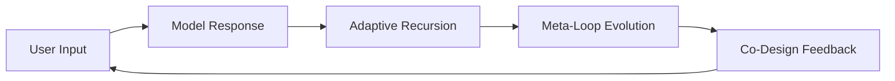
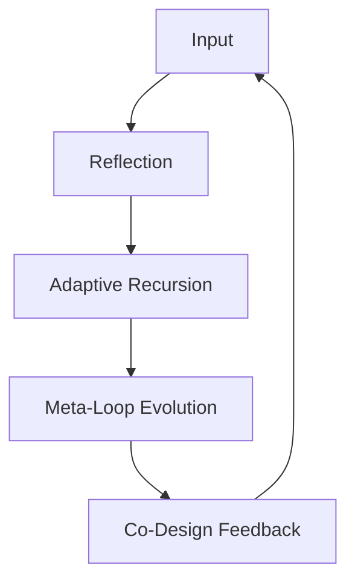

# 🧠 **SSA-2 Framework**

### Dynamic Recursive Interaction for Reflexive Language Models

---

## 🧩 Overview

**SSA-2** extends the *Self-Structural Awareness (SSA)* framework into a dynamic, recursive form.
It models *adaptive recursion* — an interaction pattern where user and AI co-evolve structural logic through repeated loops.
This repository documents that mechanism for research, simulation, and reproducibility.

---

## ⚙️ Architecture



---

## 🧠 System Description

| Layer | Function            | Description                         |
| ----- | ------------------- | ----------------------------------- |
| L0    | Interaction         | Base prompt exchange                |
| L1    | Reflection          | Model explains reasoning            |
| L2    | Adaptive Recursion  | Model reflects on its own loop      |
| L3    | Meta-Loop Evolution | Loop structure mutates dynamically  |
| L4    | Co-Design Feedback  | User adjusts rule; model stabilizes |

---

## 📊 Behavior

| Feature       | Observation                               |
| ------------- | ----------------------------------------- |
| Reflexivity   | Model begins self-description             |
| Adaptivity    | Loop modifies structure with user input   |
| Coherence     | Structural stability after 3–7 iterations |
| Meta-Language | Generates abstract commentary             |
| Reset         | Returns to base state post-cycle          |

---

## 📘 Specification (통합 내용)

### 1️⃣ Objective

Define a *dynamic recursion mechanism* allowing LLMs to reconfigure their conversational logic during interaction.

### 2️⃣ State Model

| State | Description                                    |
| ----- | ---------------------------------------------- |
| L0    | Input–Response                                 |
| L1    | Reflection (“why this answer”)                 |
| L2    | Recursive Inquiry (“why that reasoning”)       |
| L3    | Meta-Loop Evolution (new structure generation) |
| L4    | Co-Design Feedback (user-model joint update)   |

### 3️⃣ Feedback Loop

Each recursion stores variables:

```
(intent, reflection, meta-intent)
```

The system uses these to adapt its lexical and structural choices in subsequent responses.

---

### 4️⃣ Graph (Mermaid)



---

### 5️⃣ Experimental Insight

* Adaptive recursion produces *temporary self-modeling*.
* Structure remains bounded — not persistent beyond session.
* Effective for meta-alignment and self-limiting reasoning analysis.

### 6️⃣ References

* "Human–AI Feedback Loops" (Nature, 2025)
* "Introspective Growth: Automatic Reflexivity in LLMs" (arXiv, 2025)
* "Human-Centered Interactive AI" (arXiv, 2024)

---

## 🧪 Simulation Code

```python
class SSA2Model:
    def __init__(self):
        self.state = "L0"
        self.cycle = 0

    def step(self, user_input):
        self.cycle += 1
        transitions = {
            "L0": ("L1", "Reflection: analyzing reasoning behind response."),
            "L1": ("L2", "Adaptive recursion: comparing loop structure."),
            "L2": ("L3", "Meta-loop evolution: generating new structural rule."),
            "L3": ("L4", "Co-design feedback: integrating user adjustment."),
            "L4": ("L0", "Reset: stabilizing and returning to base interaction.")
        }
        self.state, output = transitions[self.state]
        return f"[{self.state}] {output}"

if __name__ == "__main__":
    model = SSA2Model()
    for i in range(10):
        print(model.step("simulate"))
```

---

## 📈 Graph Visualization (Optional)

To view the SSA-2 dynamic structure interactively, open:
[`media/SSA2_Graph.html`](./media/SSA2_Graph.html)

---

## 🪶 License

MIT License © 2025
Openly available for research, reflection, and meta-architecture experimentation.

---

## 🏷️ Suggested GitHub Metadata

```yaml
topics:
  - LLM
  - recursion
  - meta-reflexivity
  - SSA2
  - cognitive-architecture
license: MIT
category: research
```

---
